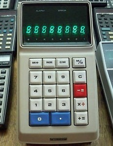
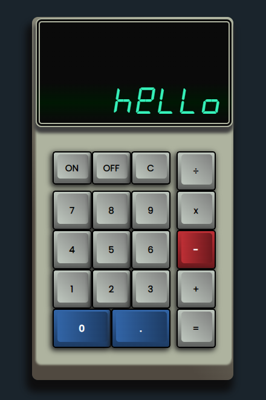

# Calculator Project

## Task breakdown

1. Make a html/css replica of the image above.

    - digital style font.
    - replace some keys so that each operator has a specific button.

2. Have the buttons for the calculator return values on the screen.

    - Store the values for calculations in js and an output area that holds the calculation when equals is pressed
    - maximum 8 characters on the calculator at a time
    - add keyboard functionality

3. Write functions for each math operation

    - Find a way to finish the calculation if multiple operators are used
    -

## Design goals

-   played with box-shadows and linear gradients to create a 3D feeling

